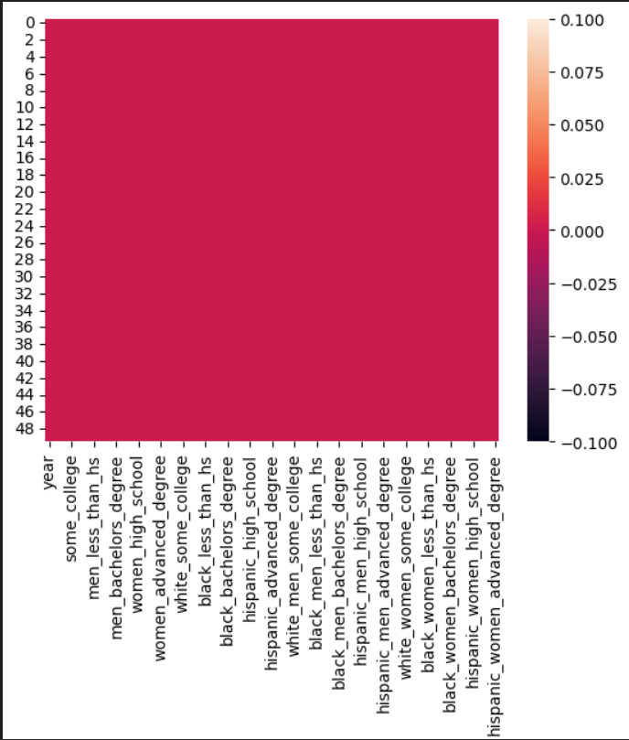
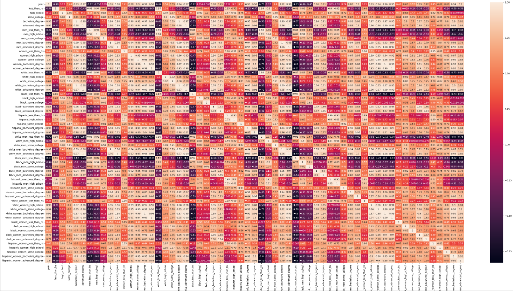
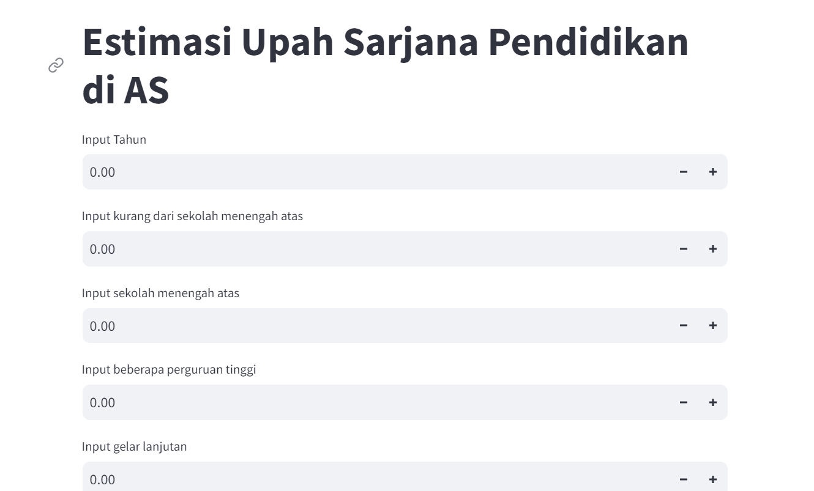

# Laporan Proyek Machine Learning

### Nama : Aditya Budiansyah

### Nim : 211351004

### Kelas : Pagi B

## Domain Proyek

Data yang telah diperoleh dapat digunakan sebagai gambaran dari sumber penghasilan yang berada di USA dilihat dari tingkat pendidikannya. Adapun tujuan dari penggunaan data ini sebagai gambaran dari penghasilan yang akan di dapat sebagai calon sarjana.

**Rubrik/Kriteria Tambahan (Opsional)**:

- Data dan output ini dapat digutuhkan guna digunakan sebagai gambaran dari penghasilan yang akan di dapat sesuai dengan tingkatan Pendidikan kita, sehingga kita dapat mempertimbangkan tentang tingkat Pendidikan ke depannya.

- Menyertakan hasil riset terkait atau referensi. Referensi yang diberikan harus berasal dari sumber yang kredibel dan author yang jelas.

  Format Referensi: [Education pays, 2021](https://www.bls.gov/careeroutlook/2022/data-on-display/education-pays.htm)

## Business Understanding

Dapat melihat gambaran dari data nyata yang sudah diambil selama beberapa tahun terakhir tentang penghasilan yang didapat berdasarkan tingkat Pendidikan

Bagian laporan ini mencakup:

### Problem Statements

Menjelaskan pernyataan masalah latar belakang:

- Masalah ini dapat dilihat dari banyaknya orang yang masih menyepelekan soal Pendidikan sehingga kurang terbuka mengenai pekerjaan di kemudian harinya

### Goals

Menjelaskan tujuan dari pernyataan masalah:

- - Maka dari itu riset yang telah dilakukan dan hasil dari riset ini dapat membuka pemikiran masyarakat luas mengenai pentingnya Pendidikan dan seberapa berpengaruhnya Pendidikan untuk keberlangsungan hidup di masa depan, terutama untuk generasi muda agar lebih memikirkan lagi tentang Pendidikan ayang akan menjadi penting di kehidupannya kelak

Semua poin di atas harus diuraikan dengan jelas. Anda bebas menuliskan berapa pernyataan masalah dan juga goals yang diinginkan.

### Solution statements

- Menyebarluaskan website yang berisi data mengenai hasil pendapatan berdasarkan tingkat Pendidikan kepada pelajar, mahasiswa, orang tua, maupun masyarakat luas
- Mengadakan sosialisasi mengenai pentingnya Pendidikan dan seberapa berpengaruhnya terhadap kehidupan di masa depan kelak.
- Model yang dihasillkan dari datasets ini menggunakan metode Linear Regression.

## Data Understanding

Kumpulan data Upah berdasarkan Pendidikan memberikan wawasan tentang upah rata-rata per jam pekerja di AS, yang dipilah berdasarkan tingkat pendidikan tertinggi yang dicapai.

Kumpulan data ini mencakup periode 1973 hingga 2022 dan bersumber dari Perpustakaan Data State of Working America milik Economic Policy Institute.

[Wages by Education in the USA (1973-2022)](https://www.kaggle.com/datasets/asaniczka/wages-by-education-in-the-usa-1973-2022).

Selanjutnya uraikanlah seluruh variabel atau fitur pada data. Sebagai contoh:

### Variabel-variabel pada Wages by Education in the USA adalah sebagai berikut:

- year : menunjukan tahun (int64)
- less_than_hs : kurang dari menunjukan sekolah menengah atas (float64)
- high_school : menunjukan sekolah menengah atas (float64)
- some_college : menunjukan beberapa perguruan tinggi (float64)
- bachelors_degree : menunjukan gelar sarjana (float64)
- advanced_degree : menunjukan gelar lanjutan (float64)
- men_less_than_hs : menunjukan laki laki kurang dari sekolah menengah atas (float64)
- men_high_school : menunjukan sekolah menengah laki laki (float64)
- men_some_college : menunjukan laki laki beberapa perguruan tinggi (float64)
- men_bachelors_degree : menunjukan gelar sarjana laki laki (float64)
- men_advanced_degree : menunjukan gelar lanjutan laki laki (float64)
- women_less_than_hs : menunjukan perempuan kurang dari sekolah menengah atas (float64)
- women_high_school : menunjukan sekolah menengah perempuan (float64)
- women_some_college : menunjukan perempuan beberapa perguruan tinggi (float64)
- women_bachelors_degree : menunjukan gelar sarjana perempuan (float64)
- women_advanced_degree : menunjukan gelar lanjutan perempuan (float64)
- white_less_than_hs : menunjukan kulit putih kurang dari sekolah menengah atas (float64)
- white_high_school : menunjukan sekolah menengah kulit putih (float64)
- white_some_college : menunjukan kulit putih beberapa perguruan tinggi (float64)
- white_bachelors_degree : menunjukan gelar sarjana kulit putih (float64)
- white_advanced_degree : menunjukan gelar lanjutan kulit putih (float64)
- black_less_than_hs : menunjukan kulit hitam kurang dari sekolah menengah atas (float64)
- black_high_school : menunjukan sekolah menengah kulit hitam (float64)
- black_some_college : menunjukan kulit hitam beberapa perguruan tinggi (float64)
- black_bachelors_degree : menunjukan gelar sarjana kulit hitam (float64)
- black_advanced_degree : menunjukan gelar lanjutan kulit hitam (float64)
- hispanic_less_than_hs : menunjukan hispanik kurang dari sekolah menengah atas (float64)
- hispanic_high_school : menunjukan sekolah menengah hispanik (float64)
- hispanic_some_college : menunjukan hispanik beberapa perguruan tinggi (float64)
- hispanic_bachelors_degree : menunjukan gelar sarjana hispanik (float64)
- hispanic_advanced_degree : menunjukan gelar lanjutan hispanik (float64)
- white_men_less_than_hs : menunjukan laki laki kulit putih kurang dari sekolah menengah atas (float64)
- white_men_high_school : menunjukan sekolah menengah laki laki kulit putih (float64)
- white_men_some_college : menunjukan laki laki kulit putih beberapa perguruan tinggi (float64)
- white_men_bachelors_degree : menunjukan gelar sarjana laki laki kulit putih (float64)
- white_men_advanced_degree : menunjukan gelar lanjutan laki laki kulit putih (float64)
- black_men_less_than_hs : menunjukan laki laki kulit hitam kurang dari sekolah menengah atas (float64)
- black_men_high_school : menunjukan sekolah menengah laki laki kulit hitam (float64)
- black_men_some_college : menunjukan laki laki kulit hitam beberapa perguruan tinggi (float64)
- black_men_bachelors_degree : menunjukan gelar sarjana laki laki kulit hitam (float64)
- black_men_advanced_degree : menunjukan gelar lanjutan laki laki kulit hitam (float64)
- hispanic_men_less_than_hs : menunjukan laki laki hispanik kurang dari sekolah menengah atas (float64)
- hispanic_men_high_school : menunjukan sekolah menengah laki laki hispanik (float64)
- hispanic_men_some_college : menunjukan laki laki hispanik beberapa perguruan tinggi (float64)
- hispanic_men_bachelors_degree : menunjukan gelar sarjana laki laki hispanik (float64)
- hispanic_men_advanced_degree : menunjukan gelar lanjutan laki laki hispanik (float64)
- white_women_less_than_hs : menunjukan perempuan kulit putih kurang dari sekolah menengah atas (float64)
- white_women_high_school : menunjukan sekolah menengah perempuan kulit putih (float64)
- white_women_some_college : menunjukan perempuan kulit putih beberapa perguruan tinggi (float64)
- white_women_bachelors_degree : menunjukan gelar sarjana perempuan kulit putih (float64)
- white_women_advanced_degree : menunjukan gelar lanjutan perempuan kulit putih (float64)
- black_women_less_than_hs : menunjukan perempuan kulit hitam kurang dari sekolah menengah atas (float64)
- black_women_high_school : menunjukan sekolah menengah perempuan kulit hitam (float64)
- black_women_some_college : menunjukan perempuan kulit hitam beberapa perguruan tinggi (float64)
- black_women_bachelors_degree : menunjukan gelar sarjana perempuan kulit hitam (float64)
- black_women_advanced_degree : menunjukan gelar lanjutan perempuan kulit hitam (float64)
- hispanic_women_less_than_hs : menunjukan perempuan hispanik kurang dari sekolah menengah atas (float64)
- hispanic_women_high_school : menunjukan sekolah menengah perempuan hispanik (float64)
- hispanic_women_some_college : menunjukan perempuan hispanik beberapa perguruan tinggi (float64)
- hispanic_women_bachelors_degree : menunjukan gelar sarjana perempuan hispanik (float64)
- hispanic_women_advanced_degree : menunjukan gelar lanjutan perempuan hispanik (float64)

## Data Preparation

### Data Collection

Untuk data collection ini, saya mendapatkan dataset yang nantinya digunakan dari website kaggle dengan nama dataset Wages by Education in the USA

### Data Discovery And Profiling

Untuk bagian ini, kita akan menggunakan teknik EDA. <br>
Pertama kita mengimport semua library yang dibutuhkan,

```bash
import pandas as pd
import numpy as np
import matplotlib.pypot as plt
import seaborn as sns
```

Karena kita menggunakan google colab untuk mengerjakannya maka kita akan import files juga,

```bash
from google.colab import files
```

Lalu mengupload token kaggle agar nanti bisa mendownload sebuah dataset dari kaggle melalui google colab

```bash
file.upload()
```

Setelah mengupload filenya, maka kita akan lanjut dengan membuat sebuah folder untuk menyimpan file kaggle.json yang sudah diupload tadi

```bash
!mkdir -p ~/.kaggle
!cp kaggle.json ~/.kaggle/
!chmod 600 ~/.kaggle/kaggle.json
!ls ~/.kaggle
```

lalu mari kita download datasetsnya

```bash
!kaggle datasets download -d azadshahvaladov/wages-by-education-in-the-usa-1973-2022
```

Selanjutnya kita harus extract file yang tadi telah didownload

```bash
!mkdir wages-by-education-in-the-usa-1973-2022
!unzip wages-by-education-in-the-usa-1973-2022.zip -d wages-by-education-in-the-usa-1973-2022
!ls wages-by-education-in-the-usa-1973-2022
```

Mari lanjut dengan memasukkan file csv yang telah diextract pada sebuah variable, dan melihat 5 data paling atas dari datasetsnya

```bash
df = pd.read_csv("wages-by-education-in-the-usa-1973-2022/wages_by_education.csv")
df.head()
```

Untuk melihat mengenai type data dari masing masing kolom kita bisa menggunakan property info,

```bash
df.info()
```

Selanjutnya kita akan memeriksa apakah datasetsnya terdapat baris yang kosong atau null dengan menggunakan seaborn,

```bash
sns.heatmap(df.isnull())
```

 <br>

Mari kita lanjut dengan data exploration kita,

```bash
plt.figure(figsize=(10,8))
sns.heatmap(df.corr(), annot=True)
```



## Modeling

sebelumnya mari kita import library yang nanti akan digunakan,

```bash
from sklearn.model_selection import train_test_split
from sklearn.linear_model import LinearRegression
```

Langkah pertama adalah memasukkan kolom-kolom fitur yang ada di datasets dan juga kolom targetnya,

```bash
features = ['year','less_than_hs','high_school','some_college','advanced_degree','men_less_than_hs','men_high_school','men_some_college','men_bachelors_degree','men_advanced_degree','women_less_than_hs','women_high_school','women_some_college','women_bachelors_degree','women_advanced_degree']
x = df[features]
y = df['bachelors_degree']
x.shape, y.shape
```

Selanjutnya kita akan menentukan berapa persen dari datasets yang akan digunakan untuk test dan untuk train

```bash
x_train, X_test, y_train, y_test = train_test_split(x,y,random_state=70)
y_test.shape
```

lalu membuat mode dan memasukkan X_train dan y_train pada model dan memasukkan value predict pada y_pred,

```bash
lr = LinearRegression()
lr.fit(x_train,y_train)
pred = lr.predict(X_test)
```

sekarang kita bisa melihat score dari model kita,

```bash
score = lr.score(X_test, y_test)
print('akurasi model regresi linier = ', score)
```

Bagus juga, 99.97%, mari kita test menggunakan sebuah array value

```bash
input_data = np.array([[2021,16.74,22.28,24.92,53.45,18.34,24.36,27.96,47.83,63.52,14.36,19.36,21.97,35.08,44.8]])

prediction = lr.predict(input_data)
print('Estimasi bachelors degree education :', prediction)
```

berhasil!!, sekarang modelnya sudah selesai, mari kita export sebagai sav agar nanti bisa kita gunakan pada project web streamlit kita.

```bash
import pickle

filename = 'estimasi-wages-by-education-in-the-usa.sav'
pickle.dump(lr,open(filename,'wb'))
```

## Evaluation

Disini saya menggunakan R2 score sebagai metrik evaluasi.

R-squared atau R2 pada dasarnya digunakan untuk melihat bagaimana penambahan variabel independen membantu menjelaskan varians variabel dependen. Secara umum R2 dapat memberikan ukuran seberapa baik model dalam menjelaskan variabel dependen (variabel yang dipengaruhi) atau goodness of fit.

R2 secara definisi merupakan rasio dari varians yang dijelaskan oleh variabel independen (penjelas) dibandingkan varians tanpa adanya variabel independen, berikut rumus dari R2.

R2 = SSE/SST = 1 - SSR/SST

Setelah itu saya menerapkannya dalam kode menggunakan fungsi r2_score, seperti berikut :

```bash
from sklearn.metrics import r2_score

r2 = r2_score(y_test, pred)
print('r2 score for perfect model is', r2)
```

dan hasil yang saya dapatkan adalah 0.9997690717252785 atau 99.97%, itu berarti model ini memiliki keseimbangan yang baik antara presisi dan recall.

## Deployment

[My Estimation App](https://app-wages-by-education-in-the-usa-aditya.streamlit.app/).



##
